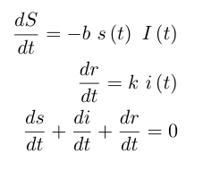

# COVID19 Travel (Un)planner
_Hackathon project submission repository for Pod 0.3.1 (Lazy Lobsters) Team 1_

<p align="center">

<br />
<h3 align="center">COVID19 Travel (Un)planner</h3>
</p>

## Project Description
This project aims to use SciML to fit a differential equation to the COVID-19 Number-Of-Cases time series data. This would allow us to predict the number of cases in the future, to some degree of accuracy. This would be done separately per district or state, as per the availability of reliable data. The results would be displayed on an interactive graphical webpage.

The project also implements an interesting use case of the prediction model: a mobile application that is a personal scheduler/calendar. The user can enter where they are headed to in the next few days, and the application would warn them if those regions are predicted to have a high number of cases then.

Data sourced from https://api.covid19india.org/.

## Source organization

- Server code is present in [`Server`](Server/) directory
- Datasets and the preprocessing script used are present in [`Dataset`](Dataset/) directory
- Trained models are in [`BSON`](https://github.com/JuliaIO/BSON.jl) format in the [`Server/data`](Server/data) directory
- Source of react native application is present in the [`Application/`](Application/) directory with the build files (APK et al) in [`Application/dist`](Application/dist) directory


<p align="center">
	<i>Web Application Homepage</i>
</p>

## Tech Stack

- Julia : For the backend
- React Native : For the Application
- DiffEqFlux : For training district wise models

## Local Setup

1. Clone repository
```
	git clone https://github.com/MLH-Fellowship/0.3.1-team1-COVIDTravelPlanner && cd 0.3.1-team1-COVIDTravelPlanner
```

2. Install the server dependencies
```
	julia --project=./Server -e "using Pkg; Pkg.instantiate()"
```

3. Start the server
```
	julia --project=./Server Server/server.jl
```

4. _TODO: application instructions_


## Predictive Models for Covid19

We provide the code for training the neural network models and running inference using them in the `Covid19Modelling` module inside `Server/lib`. First we need to install the
dependencies using 
```
	julia --project=./Server -e "using Pkg; Pkg.instantiate()"
```

### Training the models

Our models need to be retrained daily / whenever a new data point is available. To train the model on a single
district run the following code:

```julia
include("Server/lib/Covid19Modelling.jl") # Import the module

# The dataset needs to be updated on a daily basis
Covid19Modelling.train_named_locations("Dataset/final.csv", [<Names of Districts>], [<Names of States>], retrain = true, each_epochs = 100)
```

If all the models need to be retrained, simply change the last line above to the following

```julia
Covid19Modelling.train_alll_districts("Dataset/final.csv", retrain = true, each_epochs = 100)
```

### Getting the model predictions

Once the models are trained to obtain the predictions for the next 7 days, we do the following:

```julia
# Gives the predictions for the next 7 days
Covid19Modelling.prediction(<Name of state>, <Name of District>, [1, 2, 3, 4, 5, 6, 7])

# Gives the predictions for the 2nd, 4th and 6th day from today
Covid19Modelling.prediction(<Name of state>, <Name of District>, [2, 4, 6])

# Gives the predictions for day after tomorrow
Covid19Modelling.prediction(<Name of state>, <Name of District>, 2)
```
Basically, you can get the predictions for any day in the next week. The function returns the total active cases and the total resolved cases (recovered + deceased)


### Model Description

We model our Differential Equations as follows using the DifferentialEquations.jl packages

<p align="center">
  
</p>

We draw inspiration from the previous works [1] and [2]. We use a multilayer perceptron to parameterize the differential equations
and using backpropogation through the solver we are able to learn the parameters in an end-to-end manner. To learn to predict the case
counts we use minimize the weighted squared difference between the log of the case numbers.

## References

[1] Rackauckas, Christopher, et al. "Universal Differential Equations for Scientific Machine Learning." arXiv preprint arXiv:2001.04385 (2020).

[2] Dandekar, Raj, and George Barbastathis. "Quantifying the effect of quarantine control in Covid-19 infectious spread using machine learning." medRxiv (2020).

