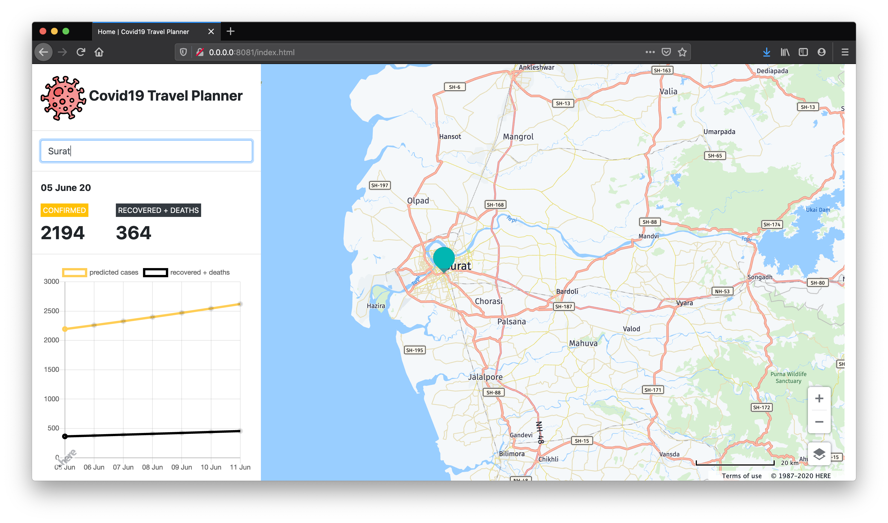

# COVID19 Travel (Un)planner
_Hackathon project submission repository for Pod 0.3.1 (Lazy Lobsters) Team 1_

<p align="center">

<br />
<h3 align="center">COVID19 Travel (Un)planner</h3>
</p>

## Project Description
This project aims to use SciML to fit a differential equation to the COVID-19 Number-Of-Cases time series data. This would allow us to predict the number of cases in the future, to some degree of accuracy. This would be done separately per district or state, as per the availability of reliable data. The results would be displayed on an interactive graphical webpage.

The project also implements an interesting use case of the prediction model: a mobile application that is a personal scheduler/calendar. The user can enter where they are headed to in the next few days, and the application would warn them if those regions are predicted to have a high number of cases then.

Data sourced from https://api.covid19india.org/.

## Source organization

- Server code is present in [`Server`](Server/) directory
- Datasets and the preprocessing script used are present in [`Dataset`](Dataset/) directory
- Trained models are in [`BSON`](https://github.com/JuliaIO/BSON.jl) format in the [`Server/data`](Server/data) directory
- Source of react native application is present in the [`Application/`](Application/) directory with the build files (APK et al) in [`Application/dist`](Application/dist) directory



<p align="center">
	<i>Web Application Homepage</i>
</p>

## Tech Stack

- Julia : For the backend
- React Native : For the Application
- DiffEqFlux : For training district wise models

## Local Setup

1. Clone repository
```
	git clone https://github.com/MLH-Fellowship/0.3.1-team1-COVIDTravelPlanner && cd 0.3.1-team1-COVIDTravelPlanner
```

2. Install the server dependencies
```
	julia --project=./Server -e "using Pkg; Pkg.instantiate()"
```

3. Start the server
```
	julia --project=./Server Server/server.jl
```

4. _TODO: application instructions_

